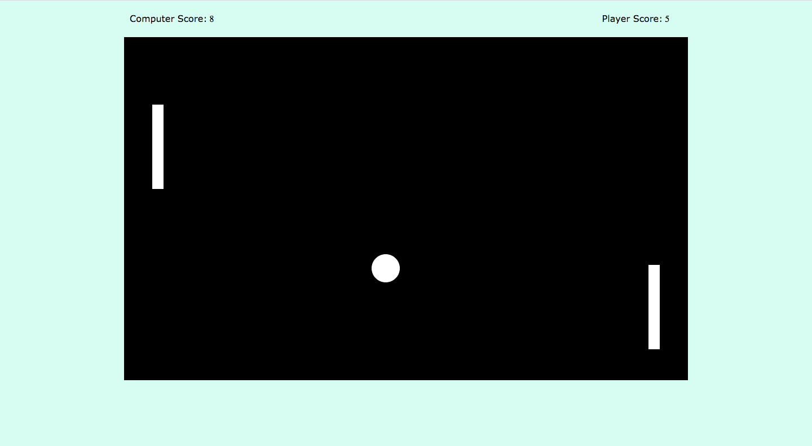

# Magic Pong

## Description
Magic Pong is a modern take on the classic game of Pong. Built with pure Vanilla JavaScript, Magic Pong is a game that you can start as soon as your browser loads. Users play against a Computer (a.k.a the left paddle) in which whoever reaches 11 points first wins the game. The game ends with either a win or lose message and instructs the user to refresh their browser to start a new game. 

Magic Pong makes use of the HTML5 Canvas element to render the paddles and the ball and to allow animation to take place.


# Viewing the Project

A demo of Magic Pong can be viewed on Heroku: https://magic-pong-game.herokuapp.com/

# Getting Started

## Installation

All you have to do to install Magic Pong on your local server is to clone this repo inside a directory on your local machine

`$ git clone https://github.com/ARodriguezHacks/magicpong.git`

or

`$ git clone https://github.com/ARodriguezHacks/magicpong.git your-preferred-name-for-project`

`cd` into your newly cloned directory

`$ cd magicpong`

Now you can open your index.html file in your browser and the game will immediately start. All you do now is move the up and down arrow keys to control the right paddle and try to beat the Computer!


The moment you open the index.html in your browser, the ball will immediately start moving and the game will commence. Within the indx.html you can adjust the values for various items including ball velocity, player and computer velocities, and score limit.

When the game ends the computer and player scores are reset to 0, and a Win or Loss message appears depending on the Computer or Player winner.

## Sample Code

The sample below demonstrates a portion of the Ball object's move method. The move method first grabs the HTML canvas element's context through a DOM selector method. Next the variable that is assigned the canvas' context calls on its clearRect() method to clear the canvas to support animation of the ball moving. Then the render() method is called which includes calling various methods to render the two paddles, the ball so that the browser upon loading has everything working and rendering properly. 

The code also demonstrates that when the Player's score reaches 11, the Ball object will call on its stop method to stop itself from moving, and a hidden HTML element will appear on the screen with a "You won!" message. Then both paddles will be reset to 0.


index.html
```
 Ball.prototype.move = function move() {
    var canvas = document.getElementById("myCanvas");
    var ctx = canvas.getContext('2d');
    ctx.clearRect(0, 0, 1000, 610);
    render();

  ...
  
    if (this.y + this.vy > (canvas.height - 35) ||
       this.y + this.vy < 35) {
          this.vy = -this.vy;
    }

    if (playerScore === 11 ) {
       this.stop();
       winMessage.style.visibility = "visible";
       restartMessage.style.visibility = "visible";
       playerScore = 0;
       playerScoreTotal.innerHTML = playerScore;
       computerScore = 0;
       computerScoreTotal.innerHTML = computerScore;
     }
   
```


## Technologies Used:

* HTML5 (HTML Canvas element)
* CSS3
* Vanilla JavaScript

## Additional Screenshots:



